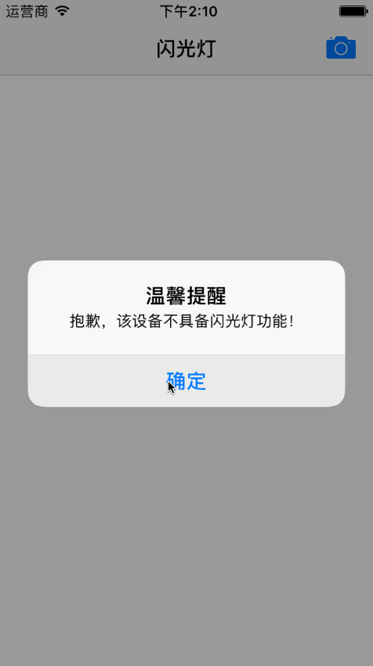

# SYFlashLight
iPhone设备闪光灯的使用方法封装

# 使用方法
~~~ javascript
// 导入framework：AVFoundation.framework

// 导入头文件
#import "SYFlashLight.h"

// 使用，开灯或关灯
[[SYFlashLight shareFlash] openFlashLight:^(BOOL hasFlash, BOOL isOpen) {
    if (hasFlash) {
        if (isOpen) {
            [[[UIAlertView alloc] initWithTitle:@"温馨提示" message:@"已经打开闪光灯" delegate:nil cancelButtonTitle:nil otherButtonTitles:@"知道了", nil] show];
        } else {
            [[[UIAlertView alloc] initWithTitle:@"温馨提示" message:@"已经关闭闪光灯" delegate:nil cancelButtonTitle:nil otherButtonTitles:@"知道了", nil] show];
        }
    } else {
        [[[UIAlertView alloc] initWithTitle:@"温馨提示" message:@"没有闪光灯功能" delegate:nil cancelButtonTitle:nil otherButtonTitles:@"知道了", nil] show];
    }
}];

~~~

## 修改说明
* 20181014
  * 版本号：1.1.0
  * 修改完善
    * 改成单例实现
    * 实现方法回调
      * 判断设备是否支持
      * 是否打开或关闭
      
* 20171017
  * 版本号：1.0.1
  * 源码与示例分离
